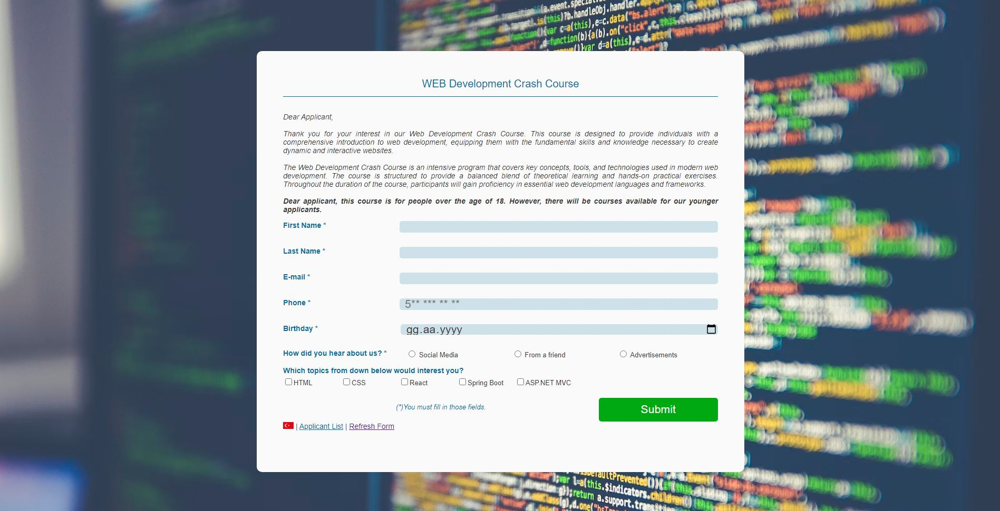
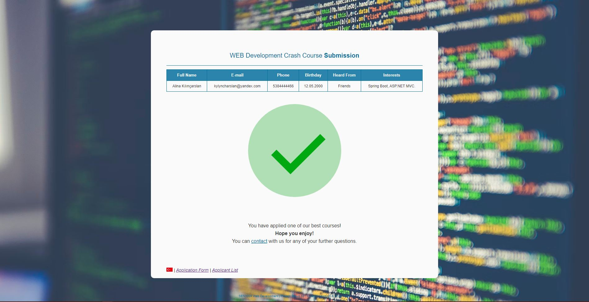
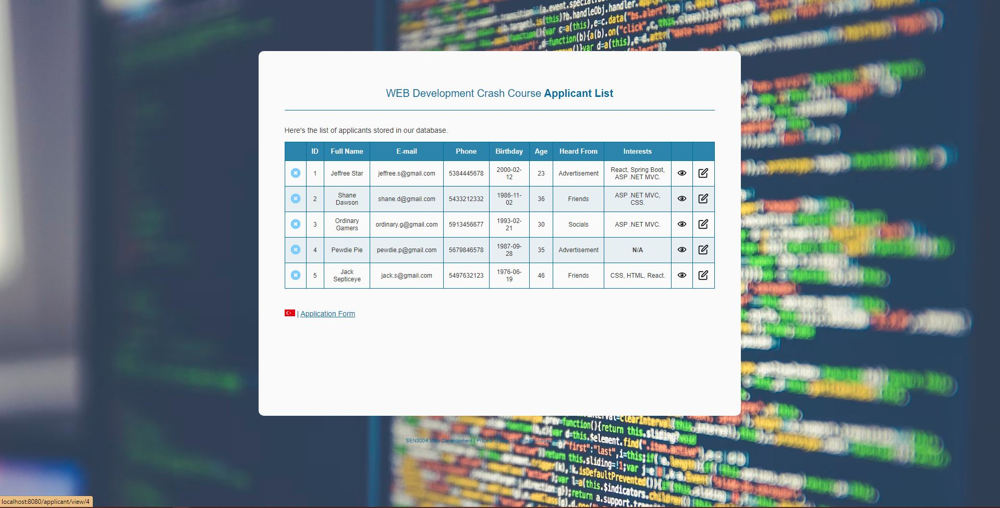

# Web Development - Term Project
- A simple localized form submission with database interactions. Made with Spring Boot framework, as a project for my Web Development uni course. 
-------------------------------------------------------
- Database is implemented using an in-memory H2 database.
- HTMLs done by the other project member.
- Thymeleaf used.
- JPA is used for database interactions.
- English and Turkish previews avaliable for each view.
-------------------------------------------------------
- Form submission view.

- Successful submission result view.

- Database user interface.

